# Unified Master Architecture Plan: Tri-Tier Hybrid Sandbox Engine

## 1. Executive Summary & Threat Model

### 1.1 System Purpose
This Master Architecture Plan defines the design for the Bubblewrap sandbox engine in `extensions/bwrap-sandbox`.
The engine delivers zero-latency deterministic command policy evaluation, bounded machine intelligence risk review, and kernel-level Linux OS isolation for shell execution.

### 1.2 Tri-Tier Architecture Overview
The system replaces single-layer classifier gating with a Tri-Tier Hybrid Engine:
- **Tier 1: AST Parsing & Fast-Path Policy**: Uses `tree-sitter-bash` command decomposition and Starlark/JSON deterministic rule evaluation to authorize or block shell calls instantly without provider latency.
- **Tier 2: LLM Risk Reviewer**: Invokes a single structured LLM review (`openai/gpt-5.6-luna` or configured provider) only when Tier 1 results are indeterminate, command constructs are dynamic, or mutating actions require risk assessment.
- **Tier 3: Hardened OS Execution Boundary**: Enforces Linux kernel containment through Bubblewrap mount namespaces, Landlock LSM filesystem path rules, Seccomp BPF syscall filters, and tool-managed ephemeral cache auto-mounts.

### 1.3 Core Security Invariants
The architecture enforces six non-negotiable security invariants across all execution paths:

1. **OS Boundary Supremacy**:
   Linux kernel isolation (Bubblewrap + Landlock LSM + Seccomp BPF) is the primary security boundary.
   Static rules and LLM classifier decisions operate solely as classifier defense-in-depth and can never widen filesystem grants, relax kernel isolation, or bypass OS constraints.
   If Landlock LSM or Seccomp BPF initialization fails or is unsupported on the host, `bwrap-hardened` MUST fail closed and reject process execution (`exit(126)`). It MUST NOT fall back to unsandboxed host execution. `bwrap-hardened` is a root-owned launcher (`0755`) and is strictly NOT setuid.

2. **Strict Tri-Tier Evaluation Sequence & Disambiguated Parse Outcomes**:
   Every incoming shell call must evaluate Tier 1 static policy before any LLM provider invocation.
   Deterministic rule evaluation uses strict precedence ordering:
   `Immutable Hard Denies > Configurable Denies > Prompts/Human Review > Fast Allows > Indeterminate / Dynamic Syntax (Tier 2 LLM)`
   AST decomposition results are typed into a discriminated union (`CompleteLiteralResult`, `CompleteDynamicResult`, or `ParseFailureResult`).
   AST syntax parse errors, unparsed trailing bytes, missing nodes, or resource limit violations are `ParseFailureResult` (Hard Failures) and route immediately to a fail-closed execution block or human review. They are **NEVER** routed to Tier 2 for an automatic allow.

3. **Cryptographic Single-Use Execution Permit Contract**:
   Execution requires a cryptographic single-use permit (`ExecutionPermit`) issued AFTER MountPlan generation. The permit binds:
   - Exact tool call ID and canonical command string text.
   - Execution working directory (`cwd`) and lifecycle generation.
   - Active policy revision digest and `MountPlan` operation digest.
   - Network profile (`none`, `restricted`, or `full`).
   - Environment snapshot digest and `ExecutionAutoMountTicket` ID.
   - Landlock ruleset digest and Seccomp BPF filter digest.
   Permits are validated and consumed atomically immediately before process spawn (`execve`) and cannot be reused, transferred, or mutated.

4. **Fail-Closed Default State**:
   Any AST parsing error, WASM runtime failure, LLM timeout, schema violation, Landlock initialization error, Seccomp FD error, or permit mismatch causes immediate execution denial or fallback to interactive human approval.
   No error state can produce an unsandboxed direct host execution route.

5. **Local Deterministic File Authorization & Untrusted Project Policy Safeguard**:
   Automatic ephemeral cache mounts and workspace write bindings are derived strictly by local AST analysis and closed built-in catalog rules.
   Untrusted repository project policy files (`.pi/sandbox-rules.json`) cannot add permissions or widen access automatically via live reload without explicit human confirmation.
   Classifier model outputs and untrusted command text cannot select, widen, or infer filesystem write paths.

6. **Descriptor-Based Traversal & Credential Isolation**:
   All filesystem path resolution, managed backing directory creation, and pre-spawn revalidation use no-follow descriptor traversal (`O_NOFOLLOW`) with `uid === getuid()` ownership checks.
   Known package manager credential stores (`~/.cargo/credentials.toml`, `~/.npmrc`, `~/.pypirc`) are masked with empty read-only scaffold mounts to prevent secret exfiltration during execution.

### 1.4 Defense-In-Depth Layers

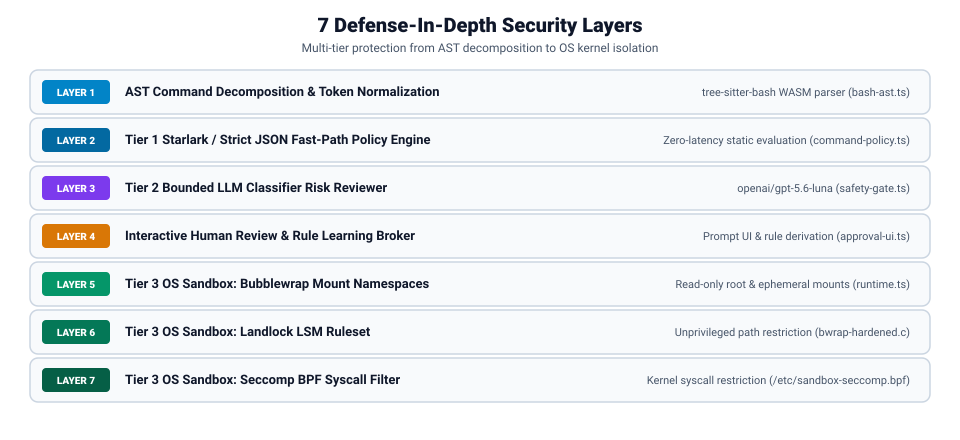

### 1.5 Threat Boundaries and Trust Model

| Component / Entity | Trust Level | Capabilities & Boundaries |
| --- | --- | --- |
| **Pi Host Process & Extension Code** | Trusted | Executes with user privileges on the host; owns policy evaluation, permit issuance, and mount planning. |
| **Root-Owned Helper Binaries** | Trusted | `/usr/bin/bwrap` and `/usr/local/bin/bwrap-hardened` must be UID 0 owned with no group/world write permissions. |
| **Human User** | Trusted | Responds to interactive approval prompts; authorizes single-use permits or persistent policy rules. |
| **Model-Generated Shell Text** | Untrusted | Shell commands passed to tool calls; treated as potentially malicious input. |
| **Repository Files & Build Scripts** | Untrusted | Source files, package manifests, and repository configuration can contain exploit payloads or hook overrides. |
| **Environment Variables** | Untrusted | External environment keys can attempt path hijacking or library preload injection. |
| **LLM Provider Outputs** | Untrusted | Responses from model providers must pass strict JSON schema validation before consumption. |
| **Sandboxed Child Process** | Untrusted | Commands executing inside Tier 3 are isolated by mount, PID, network, Landlock, and Seccomp boundaries. |

---

## 2. System Architecture & Data Flow Diagram

### 2.1 Tri-Tier Hybrid Engine Architecture

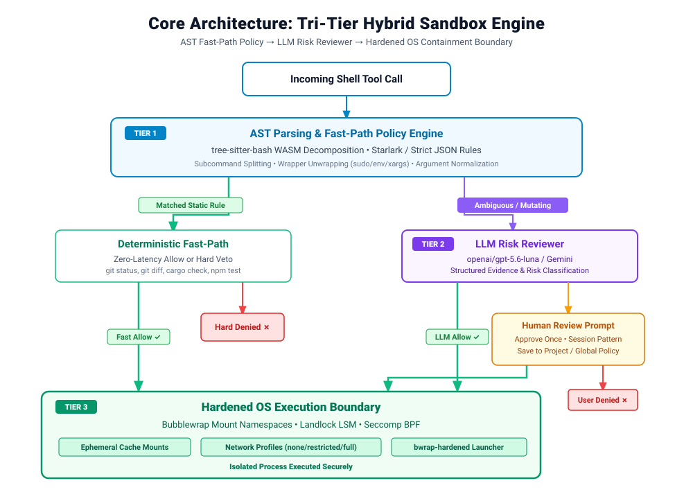

### 2.2 Complete Command Execution Sequence

The execution engine processes incoming shell commands through a modular tri-tier evaluation sequence.
The evaluation flow branches across deterministic static rule matching, bounded machine learning risk review, interactive human review, and OS kernel sandbox isolation.

#### Complete Execution Sequence Overview

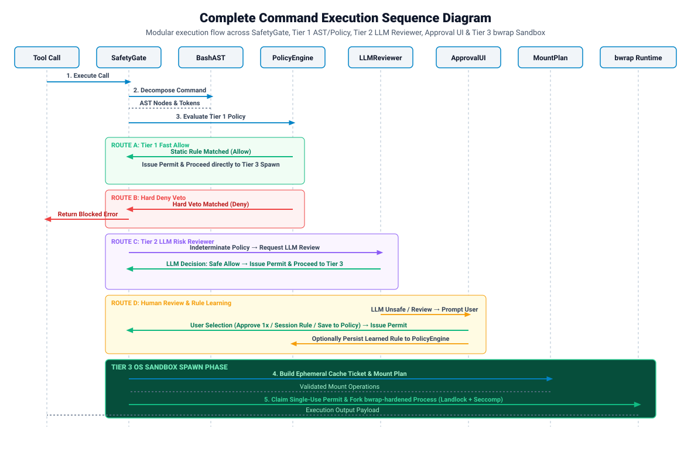

##### Step-by-Step Sequence Description
1. `SafetyGate` receives an incoming shell command from a model or host tool call.
2. `SafetyGate` invokes `BashAST` to parse syntax and decompose compound structures into subcommand units.
3. `SafetyGate` submits extracted subcommand units to `PolicyEngine` for Starlark and JSON static rule evaluation.
4. If `PolicyEngine` matches a static allow rule, `SafetyGate` issues an execution permit and branches to Sequence 2.2.1.
5. If `PolicyEngine` matches a hard-deny rule or AST parsing fails, `SafetyGate` rejects the command and branches to Sequence 2.2.2.
6. If `PolicyEngine` returns an indeterminate decision, `SafetyGate` delegates risk evaluation to `LLMReviewer` in Sequence 2.2.3.
7. If `LLMReviewer` returns a review request or encounters an error, `SafetyGate` invokes `ApprovalUI` for human review in Sequence 2.2.4.
8. Once an execution permit is issued from any authorized flow, execution advances to Tier 3 sandbox spawn in Sequence 2.2.5.


#### 2.2.1 Tier 1 Fast-Path Execution (Zero-Latency Static Allow)

The fast-path execution sequence authorizes deterministic commands instantly using local AST analysis and pre-compiled static policy rules.
This evaluation route requires no model provider API calls, network requests, or human interaction.

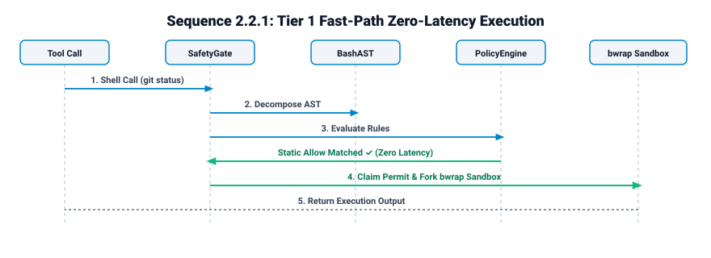

##### Step-by-Step Sequence Description
1. The tool call sends an incoming shell command string and context metadata to `SafetyGate`.
2. `SafetyGate` sends the command string to `BashAST` for syntax parsing and subcommand decomposition.
3. `BashAST` returns a complete decomposition result containing extracted subcommand units, unwrapped binaries, and token arguments.
4. `SafetyGate` passes the extracted units to `PolicyEngine` to evaluate deterministic Starlark and JSON static rules.
5. `PolicyEngine` verifies that all subcommand units match allow rules without matching any veto or prompt rules, returning an overall `allow` decision.
6. `SafetyGate` issues a cryptographic single-use execution permit bound to the tool call ID, canonical command text, working directory, and lifecycle generation.
7. `SafetyGate` routes the issued permit directly to the Tier 3 OS Sandbox Mount & Execution Spawn Phase (Sequence 2.2.5) with zero provider latency.


#### 2.2.2 Tier 1 Hard-Deny Block (Immediate Security Veto)

The hard-deny sequence halts prohibited commands or malformed inputs at Tier 1.
Static veto rules, incomplete syntax parses, or resource limit violations trigger an immediate execution block before LLM invocation or process creation.

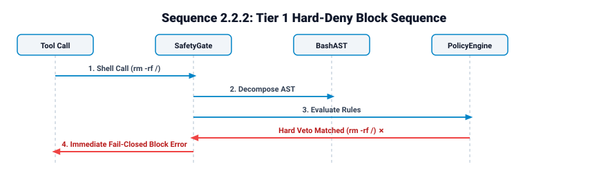

##### Step-by-Step Sequence Description
1. The tool call transmits a shell command string to `SafetyGate`.
2. `SafetyGate` submits the command string to `BashAST` for syntax parsing and token decomposition.
3. If `BashAST` encounters syntax errors, unparsed trailing bytes, or depth/byte resource limit violations, it returns a `failed` or `incomplete` status.
4. `SafetyGate` applies the fail-closed invariant to unparseable inputs and immediately returns an execution block error to the caller.
5. If parsing succeeds, `SafetyGate` passes the decomposed units to `PolicyEngine` for static policy evaluation.
6. `PolicyEngine` matches an immutable or configurable hard-deny rule (such as destructive system writes or credential store access) and returns a `deny` decision with `hardVetoMatched: true`.
7. `SafetyGate` aborts execution, prevents any provider API call, and returns a security veto error to the calling tool.


#### 2.2.3 Tier 2 LLM Risk Review & Approval Flow

The Tier 2 sequence evaluates ambiguous, dynamic, or mutating shell commands through a bounded LLM classifier review (`openai/gpt-5.6-luna`).
This tier runs only when Tier 1 static policy returns an `indeterminate` decision.

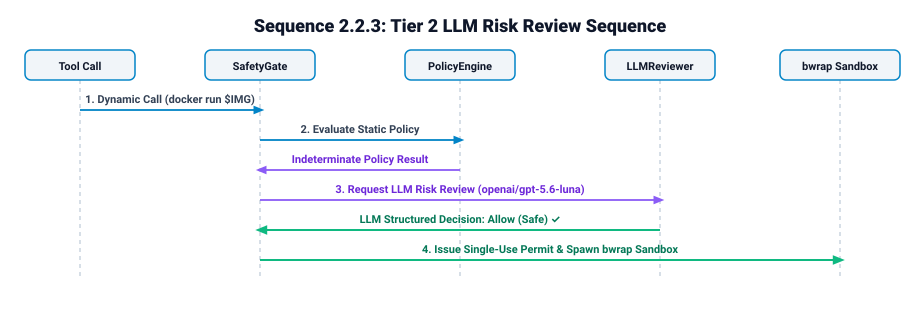

##### Step-by-Step Sequence Description
1. When Tier 1 evaluation yields an `indeterminate` decision, `SafetyGate` initiates the Tier 2 LLM review flow.
2. `SafetyGate` calls `SafetyEvidence` to assemble a bounded JSON evidence envelope containing command digests, AST metadata, environment context, and sanitized user-role conversation history.
3. `SafetyGate` passes the evidence envelope to `ClassifierProvider`, which resolves credentials and invokes the configured classifier model (`openai/gpt-5.6-luna`).
4. The LLM classifier evaluates the evidence envelope and responds using a single strict structured JSON tool call schema.
5. `ClassifierProvider` validates the response against schema rules, verifying decision values, severity levels, and risk array consistency.
6. If the classifier returns an `allow` decision with `safe` severity and empty risk flags, `SafetyGate` issues a cryptographic single-use permit and routes execution to Tier 3 (Sequence 2.2.5).
7. If the classifier returns `review`, `deny`, unsafe severity, invalid schema format, timeout, or technical failure, `SafetyGate` routes the request to `ApprovalUI` for human review (Sequence 2.2.4) without secondary model retries.


#### 2.2.4 Interactive Human Review & Policy Learning Sequence

The human review sequence provides a broker for manual authorization when static policy and classifier reviews cannot grant automatic execution.
Users can inspect command details, select write path grants, and save persistent session or project policy rules.

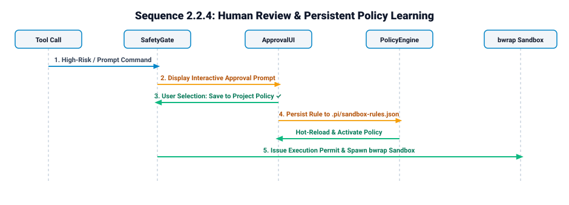

##### Step-by-Step Sequence Description
1. `SafetyGate` invokes `ApprovalBroker` when an execution request requires explicit human authorization.
2. `ApprovalBroker` renders an interactive prompt or overlay displaying canonical command text, risk flags, semantic reasons, and requested write path grants.
3. The human user selects one of three authorization options: Deny Execution, Approve Once, or Approve and Save Rule.
4. If the user selects Deny Execution, `ApprovalBroker` returns a negative result, causing `SafetyGate` to abort execution and return a user-rejection error.
5. If the user selects Approve Once, `ApprovalBroker` issues a single-use execution permit for the exact tool call ID and command string without changing persistent policy.
6. If the user selects Approve and Save Rule, `ApprovalBroker` passes approved path grants to `GrantsManager` and appends a new rule to `PolicyEngine`.
7. `PolicyEngine` recompiles active Starlark and JSON rules, `SafetyGate` issues the execution permit, and the request advances to Tier 3 (Sequence 2.2.5).


#### 2.2.5 Tier 3 OS Sandbox Mount & Execution Spawn Phase

The Tier 3 spawn sequence encloses process execution inside Linux kernel boundaries after an execution permit is validated.
The runtime configures Bubblewrap mount namespaces, Landlock LSM filesystem restrictions, Seccomp BPF syscall filters, and ephemeral cache mounts before executing the child process.

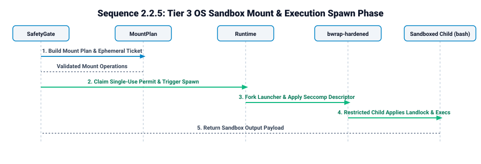

##### Step-by-Step Sequence Description
1. `SafetyGate` transfers the issued execution permit, command string, and working directory to `MountPlan`.
2. `MountPlan` reads compiled policy, active write grants, and transient tickets to build an ordered array of mount operations and ephemeral cache binds.
3. `SafetyGate` calls `SandboxRuntime.spawnSandboxedProcess()`, passing the permit, command string, and generated mount plan.
4. `SandboxRuntime` re-validates the permit against the active tool call ID, command digest, working directory, and lifecycle generation, consuming the permit atomically to prevent reuse.
5. `SandboxRuntime` executes `/usr/local/bin/bwrap-hardened` in launcher mode with `PR_SET_NO_NEW_PRIVS` enabled.
6. `bwrap-hardened` initializes isolated mount, PID, IPC, and network namespaces through Bubblewrap.
7. `bwrap-hardened` applies Landlock LSM filesystem restrictions and loads the Seccomp BPF syscall filter from `/etc/sandbox-seccomp.bpf`.
8. The Linux kernel forks and executes the sandboxed target process (`bash -c "COMMAND"`).
9. `SandboxRuntime` captures stdout, stderr, and the process exit code, cleans up ephemeral mounts, and returns the execution result payload to `SafetyGate`.

---

## 3. Tier 1: AST Decomposition & Deterministic Starlark Policy

### 3.1 WASM Parsing Strategy & Parser Runtime
Tier 1 parses complete Bash command strings without invoking a shell interpreter.
The parser utilizes `web-tree-sitter` bound to a locked `tree-sitter-bash` WASM grammar asset stored inside the extension distribution.

- **Initialization**: Process-local lazy singleton initialized during session startup.
- **Concurrency Control**: Individual parsing operations run sequentially through single-instance AST traversal to prevent mutable tree state races.
- **Error Handling**: Any syntax error, `ERROR` node, missing node, or unparsed trailing byte causes the parse status to become `incomplete` or `failed`.
- **Resource Limits**:
  - Maximum source size: 64,000 bytes.
  - Maximum AST depth: 64 levels.
  - Maximum extracted subcommands: 128 units.
  - Maximum total fragment bytes: 32,768 bytes.

### 3.2 Argument Normalization & Wrapper Chain Unwrapping
Normalization transforms extracted syntax nodes into unambiguous executable identities without querying host `PATH` or resolving symlinks:

1. **Quote Removal**: Removes syntax-proven single and double quotes while verifying literal stability.
2. **Assignment Prefix Removal**: Strips environment assignments (`FOO=bar cmd`) preceding the executable token and records variable names.
3. **Wrapper Unwrapping**: Traverses known wrapper binaries using rigid option schemas:
   - `sudo`, `env`, `time`, `stdbuf`, `nohup`, `xargs`.
   - Populates `wrapperChain` (e.g., `["sudo", "env"]`) and extracts the effective delegated executable (e.g., `/usr/bin/git` → `git`).
4. **Path Canonicalization**: Strips path prefixes (`/usr/bin/git` → `git`, `./scripts/build.sh` → `build.sh`) for policy matching, while preserving exact byte ranges for execution.

### 3.3 Subcommand Decomposition
Compound shell constructs are recursively decomposed into individual executable units:
- **Pipelines (`cmd1 | cmd2`)**: Every pipeline stage is extracted as an independent unit.
- **Logical Chains (`cmd1 && cmd2`, `cmd1 || cmd2`)**: Both branches are extracted; all branches must pass policy.
- **Subshells (`(cmd1; cmd2)`) & Command Substitutions (`$(cmd)`)**: Recurse into nested bodies and retain parent-child relations.
- **Process Substitutions (`<(cmd)`, `>(cmd)`)**: Extracted as child commands with relation `process-substitution`.
- **Conditionals & Loops (`if`, `while`, `for`)**: Traverses condition commands and all conditional execution bodies.

### 3.4 Starlark Policy Engine & JSON Schema Equivalent
Tier 1 evaluates extracted token arrays against deterministic declarative policy rules defined in restricted Starlark (`.rules`) or strict JSON (`.json`).

#### Policy Rule Precedence
The engine evaluates rules using strict priority ordering:
`Immutable Hard Denies > Configurable Denies > Prompts > Allows > Indeterminate (Tier 2)`

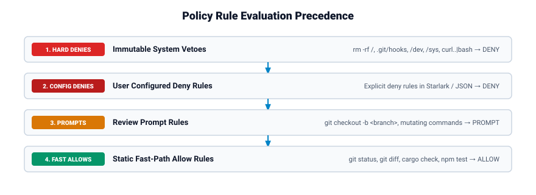

### 3.5 Type Definitions (TypeScript)

```ts
export type RuleDecision = "allow" | "prompt" | "deny";
export type EvaluationDecision = RuleDecision | "indeterminate";

export type BashDecompositionResult =
  | { readonly status: "complete"; readonly sourceBytes: number; readonly commands: readonly AstCommand[] }
  | { readonly status: "incomplete"; readonly sourceBytes: number; readonly commands: readonly AstCommand[]; readonly issues: readonly AstIssue[] }
  | { readonly status: "failed"; readonly sourceBytes: number; readonly issues: readonly AstIssue[] };

export interface AstCommand {
  readonly id: string;
  readonly parentId?: string;
  readonly relation: "top-level" | "sequence" | "pipeline" | "subshell" | "command-substitution" | "process-substitution" | "condition" | "loop" | "function" | "body";
  readonly nodeType: string;
  readonly startByte: number;
  readonly endByte: number;
  readonly source: string;
  readonly executable?: string;
  readonly executableKind: "literal" | "dynamic" | "missing";
  readonly wrapperChain: readonly string[];
  readonly literalArguments: readonly string[];
  readonly hasDynamicArguments: boolean;
  readonly assignments: readonly string[];
  readonly redirections: readonly AstRedirection[];
}

export interface AstIssue {
  readonly code: "parse-error" | "missing-node" | "unsupported-node" | "limit" | "dynamic-command" | "initialization";
  readonly startByte?: number;
  readonly endByte?: number;
}

export interface AstRedirection {
  readonly operator: string;
  readonly fileDescriptor?: string;
  readonly startByte: number;
  readonly endByte: number;
  readonly targetKind: "literal" | "dynamic" | "here-document" | "none";
}

export type PatternToken =
  | { readonly kind: "literal"; readonly value: string }
  | { readonly kind: "alternatives"; readonly values: readonly string[] }
  | { readonly kind: "wildcard"; readonly name?: string }
  | { readonly kind: "regex"; readonly source: string };

export interface PrefixRule {
  readonly id: string;
  readonly pattern: readonly PatternToken[];
  readonly tail: "any" | "none" | "bounded";
  readonly maxTailTokens?: number;
  readonly decision: RuleDecision;
  readonly justification?: string;
  readonly source: RuleSource;
}

export interface RuleSource {
  readonly scope: "builtin" | "global" | "project";
  readonly format: "builtin" | "starlark" | "json";
  readonly path?: string;
  readonly ordinal: number;
}

export interface WholePolicyEvaluation {
  readonly decision: EvaluationDecision;
  readonly units: readonly UnitEvaluation[];
  readonly hardVetoMatched: boolean;
  readonly reasons: readonly string[];
}

export interface UnitEvaluation {
  readonly commandId: string;
  readonly tokens: readonly string[];
  readonly decision: EvaluationDecision;
  readonly matches: readonly RuleMatch[];
}

export interface RuleMatch {
  readonly ruleId: string;
  readonly decision: RuleDecision;
  readonly matchedTokens: readonly string[];
  readonly source: RuleSource;
}
```

---

## 4. Tier 2: LLM Risk Reviewer (GPT-5.6-Luna / Gemini)

### 4.1 Trigger Conditions
Tier 2 is invoked only when:
1. AST decomposition status is `incomplete` or `failed` due to dynamic command names, unparseable syntax, or resource limits.
2. Tier 1 policy evaluation yields an `indeterminate` decision for one or more subcommands.
3. A command contains mutating actions, ambiguous flag combinations, or unclassified network requests.

### 4.2 Classifier Evidence Construction (`SafetyEvidence` Schema v2)
When Tier 2 is triggered, `safety-evidence.ts` constructs a bounded JSON evidence envelope containing:
- **Action Envelope**: Action digest, canonical command string, working directory, and environment context.
- **AST Decomposition Metadata**: Extracted subcommand list, wrapper chains, redirections, and issue flags.
- **User Role Context**: Recent user conversation messages in branch order with exact omission markers.
- **Secret Masking & Sanitization**: Redacts bearer tokens, authorization headers, private key blocks, and sensitive variable keys (`AWS_SECRET_ACCESS_KEY`, `GITHUB_TOKEN`, `PASSWORD`) into `[REDACTED_SECRET]`.

### 4.3 Structured Decision Contracts
The LLM reviewer must respond via a strict single tool call or structured output matching the decision schema:

```json
{
  "decision": "allow",
  "severity": "safe",
  "risks": [],
  "reason": "Command performs non-mutating repository status inspection."
}
```

- **Decision Options**: `allow`, `review`, `deny`.
- **Severity Levels**: `safe`, `low`, `medium`, `high`, `critical`.
- **Validation Rules**: Prose responses, missing fields, unrecognized enum values, contradictory decisions (e.g. `allow` with `high` severity), or extra properties reject the output and force human review.

### 4.4 Zero-Fallback Policy
Tier 2 enforces a fail-closed model:
- **Provider Unavailability / Network Failure**: Transmits request to interactive human review; no automatic execution permitted.
- **Model Refusal / Invalid Schema**: Transmits request to interactive human review.
- **Timeout / Cancellation**: Execution halts immediately; cancellation state blocks process creation.
- **No Secondary Model Fallback**: The gate never invokes a secondary model if the primary reviewer fails.

---

## 5. Tier 3: Hardened OS Execution Boundary

### 5.1 Bubblewrap + Landlock + Seccomp BPF Architecture
Tier 3 executes approved shell commands inside a Linux sandbox using three kernel security mechanisms:

```
Pi Host Process
      │
      ▼
bwrap-hardened Launcher Mode (PR_SET_NO_NEW_PRIVS = 1)
      │
      ▼
Real bwrap Binary (Mount Namespaces + Fresh /dev & /proc + Ephemeral Binds)
      │
      ▼
bwrap-hardened Restricted-Child Mode
      │  ├─ Open /etc/sandbox-seccomp.bpf -> Pass FD to Seccomp Filter
      │  ├─ Read /proc/self/mountinfo -> Classify VFS Mounts
      │  └─ landlock_create_ruleset() + landlock_restrict_self()
      ▼
Target Payload (bash -c "COMMAND")
```

### 5.2 Seccomp BPF Syscall Filter
The sandbox applies a classic Seccomp BPF filter loaded from `/etc/sandbox-seccomp.bpf`:
- **Passing Mechanism**: The host opens `/etc/sandbox-seccomp.bpf`, verifies file ownership (UID 0) and non-writable permissions, passes the open file descriptor to `bwrap`, and supplies `--seccomp <fd>`.
- **Blocked Syscalls**: Explicitly denies dangerous system calls including `ptrace`, `unshare`, `kexec_load`, `keyctl`, `reboot`, `init_module`, and `finit_module`.
- **Allowed Startup Syscalls**: Grants required setup syscalls (`prctl`, `landlock_create_ruleset`, `landlock_add_rule`, `landlock_restrict_self`, `openat`, `execve`).

### 5.3 Ephemeral Cache & Workspace Auto-Mount Engine
Standard tool build caches are automatically mounted as ephemeral, persistent host-backed write directories without requiring user prompts or LLM calls.

#### Tool Cache Catalog Definitions & Environment Variable Overrides

The engine resolves canonical cache destinations dynamically by inspecting tool-specific environment variables from a captured host environment snapshot prior to mount ticket generation.

| Tool Family | Recognized Executables | Standard Default Destination | Environment Variable Override Keys | Protected Secret Exclusions Masked |
| --- | --- | --- | --- | --- |
| **Go** | `go` | `~/.cache/go-build`, `~/go/pkg/mod` | `GOCACHE`, `GOMODCACHE`, `GOPATH` | `~/.netrc` |
| **Rust / Cargo** | `cargo`, `rustc` | `~/.cargo/registry`, `~/.cargo/git`, workspace `target/` | `CARGO_HOME`, `CARGO_TARGET_DIR` | `~/.cargo/credentials.toml` |
| **Node / npm** | `npm`, `npx` | `~/.npm` | `npm_config_cache` | `~/.npmrc` |
| **Node / pnpm** | `pnpm`, `pnpx` | `~/.pnpm-store` | `PNPM_HOME` | `~/.config/pnpm/rc` |
| **Bun** | `bun` | `~/.bun/install/cache` | `BUN_INSTALL` | `~/.bun/credentials` |
| **Python / uv** | `uv`, `uvx` | `~/.cache/uv` | `UV_CACHE_DIR` | `~/.pypirc`, `~/.config/uv/uv.toml` |
| **Python / pip** | `pip`, `pip3` | `~/.cache/pip` | `PIP_CACHE_DIR` | `~/.config/pip/pip.conf` |
| **Gradle** | `gradle`, `gradlew` | `~/.gradle/caches`, `~/.gradle/wrapper/dists` | `GRADLE_USER_HOME` | `~/.gradle/gradle.properties` |
| **Maven** | `mvn`, `mvnw` | `~/.m2/repository` | `M2_HOME` | `~/.m2/settings.xml` |

#### Custom Cache Path Resolution Algorithm & Safety Constraints

1. **Environment Override Inspection**:
   When a recognized tool call is evaluated, the resolver checks if the tool's override environment variable (e.g., `GOCACHE` for Go, `CARGO_HOME` for Rust, `UV_CACHE_DIR` for uv) is present in the execution environment snapshot.

2. **Validation & Ownership Verification**:
   If an environment variable override is set, the resolver canonicalizes the path and enforces four strict safety invariants:
   - **Absolute or Home Relative**: Must be an absolute path or expand from trusted host home (`~/...`).
   - **Ownership & Descriptor Walk**: Must pass segment-by-segment `lstatSync()` with `O_NOFOLLOW` descriptor traversal and verify `stat.uid === process.getuid()` to prevent foreign user hijacking.
   - **Broad-Root Veto**: Must NOT match or contain broad roots (`/`, `~`, `~/.config`, `~/.cache`, `~/.local`, `/usr`, `/etc`) or credential stores.
   - **No Symlink Escapes**: Must verify `realpathSync()` containment within the expected user-owned parent directory.

3. **Fallback & Fail-Closed Behavior**:
   - If no custom environment variable is set, the engine defaults to the standard XDG/home destination (e.g., `~/.cache/go-build` for `GOCACHE`).
   - If a custom environment variable path is invalid, relative to an unproven `cwd`, foreign-owned, or violates broad-root vetoes, the automatic cache mount is **withheld** for that invocation. Execution continues with normal workspace mounts, requiring explicit one-shot grants if cache write access fails.

4. **Permit Binding**:
   The resolved cache source path, destination target, and environment variable key are hashed into the `ExecutionAutoMountTicket` digest and bound to the single-use execution permit.

#### Network Namespace Profiles
- **`none` (Default)**: Network namespace disconnected (`--unshare-net`) for local builds and tests.
- **`restricted`**: Proxy pass-through mode restricted to package manager domain allowlists.
- **`full`**: Unrestricted network namespace explicitly authorized for remote operations (`git push`, `gh`, `curl`).

### 5.4 Native Landlock C Implementation Outline (`bwrap-hardened.c`)

```c
#define _GNU_SOURCE
#include <stdio.h>
#include <stdlib.h>
#include <string.h>
#include <unistd.h>
#include <fcntl.h>
#include <errno.h>
#include <sys/prctl.h>
#include <sys/stat.h>
#include <sys/syscall.h>
#include <linux/landlock.h>

#ifndef landlock_create_ruleset
static inline int landlock_create_ruleset(const struct landlock_ruleset_attr *attr, size_t size, uint32_t flags) {
    return syscall(__NR_landlock_create_ruleset, attr, size, flags);
}
#endif

#ifndef landlock_add_rule
static inline int landlock_add_rule(int ruleset_fd, enum landlock_rule_type rule_type, const void *rule_attr, uint32_t flags) {
    return syscall(__NR_landlock_add_rule, ruleset_fd, rule_type, rule_attr, flags);
}
#endif

#ifndef landlock_restrict_self
static inline int landlock_restrict_self(int ruleset_fd, uint32_t flags) {
    return syscall(__NR_landlock_restrict_self, ruleset_fd, flags);
}
#endif

int apply_landlock_boundary(void) {
    struct landlock_ruleset_attr attr = {
        .handled_access_fs = LANDLOCK_ACCESS_FS_EXECUTE |
                             LANDLOCK_ACCESS_FS_READ_FILE |
                             LANDLOCK_ACCESS_FS_READ_DIR |
                             LANDLOCK_ACCESS_FS_WRITE_FILE |
                             LANDLOCK_ACCESS_FS_REMOVE_FILE |
                             LANDLOCK_ACCESS_FS_MAKE_REG |
                             LANDLOCK_ACCESS_FS_MAKE_DIR
    };

    int ruleset_fd = landlock_create_ruleset(&attr, sizeof(attr), 0);
    if (ruleset_fd < 0) {
        if (errno == ENOSYS || errno == EOPNOTSUPP) {
            fprintf(stderr, "Fatal: Landlock LSM is unsupported on this Linux kernel. Execution denied by Fail-Closed Invariant.\n");
            return -1; // Fail-closed: Never fall back to un-landlocked execution
        }
        perror("Fatal: landlock_create_ruleset failed");
        return -1;
    }

    // Add read-only root rule
    int root_fd = open("/", O_PATH | O_CLOEXEC | O_NOFOLLOW);
    if (root_fd < 0) {
        perror("Fatal: Failed to open root path for Landlock ruleset");
        close(ruleset_fd);
        return -1;
    }

    struct landlock_path_beneath_attr path_attr = {
        .allowed_access = LANDLOCK_ACCESS_FS_EXECUTE | LANDLOCK_ACCESS_FS_READ_FILE | LANDLOCK_ACCESS_FS_READ_DIR,
        .parent_fd = root_fd
    };
    if (landlock_add_rule(ruleset_fd, LANDLOCK_RULE_PATH_BENEATH, &path_attr, 0) != 0) {
        perror("Fatal: landlock_add_rule failed for root path");
        close(root_fd);
        close(ruleset_fd);
        return -1;
    }
    close(root_fd);

    // Enable no_new_privs
    if (prctl(PR_SET_NO_NEW_PRIVS, 1, 0, 0, 0) != 0) {
        perror("prctl(PR_SET_NO_NEW_PRIVS) failed");
        close(ruleset_fd);
        return -1;
    }

    // Restrict self
    if (landlock_restrict_self(ruleset_fd, 0) != 0) {
        perror("landlock_restrict_self failed");
        close(ruleset_fd);
        return -1;
    }

    close(ruleset_fd);
    return 0;
}
```

#### LLVM Clang Compiler Security & Hardening Strategy

The critical infrastructure binary `bwrap-hardened` MUST be compiled exclusively with the **LLVM `clang` toolchain**. GCC is strictly prohibited.
The latest slim LLVM toolchain releases are sourced directly from [Kernel.org LLVM Tools](https://www.kernel.org/pub/tools/llvm/).

To maximize performance and security defense against exploitation, the compilation pipeline employs advanced LLVM Clang hardening flags:

- **Shadow Call Stack (SCS)** (`-fsanitize=shadow-call-stack`): Separates function return addresses onto a dedicated shadow stack to neutralize Return-Oriented Programming (ROP) exploits.
- **Control Flow Integrity (CFI)** (`-fsanitize=cfi -fvisibility=hidden`): Constrains indirect call targets to verified signatures to defend against Control Flow Hijacking and Jump-Oriented Programming (JOP).
- **Fat Link-Time Optimization (LTO)** (`-flto=full`): Enables whole-program analysis across translation units, required for CFI enforcement and aggressive dead-code elimination.
- **Stack Clash Protection & Hardening** (`-fstack-clash-protection -fstack-protector-strong -D_FORTIFY_SOURCE=3`): Prevents stack overflow attacks and detects buffer overflows.
- **Position Independent Executable & Full RELRO** (`-fPIE -pie -Wl,-z,relro,-z,now`): Enforces address space layout randomization (ASLR) and renders the Global Offset Table (GOT) read-only post-relocation.
- **Trivial Auto Variable Initialization** (`-ftrivial-auto-var-init=pattern`): Automatically initializes uninitialized stack variables with pattern bytes to eliminate memory disclosure vulnerabilities.

##### Production LLVM Compilation Command

```bash
clang -O3 -flto=full -fvisibility=hidden -fsanitize=cfi -fsanitize=shadow-call-stack \
      -fstack-clash-protection -fstack-protector-strong -D_FORTIFY_SOURCE=3 \
      -ftrivial-auto-var-init=pattern -fPIE -pie -Wl,-z,relro,-z,now \
      bwrap-hardened.c -o /usr/local/bin/bwrap-hardened
```

##### File Ownership & Permissions Setup

```bash
sudo chown root:root /usr/local/bin/bwrap-hardened
sudo chmod 0755 /usr/local/bin/bwrap-hardened
```

### 5.5 Execution Mount Contracts (TypeScript)

```ts
export interface ExecutionAutoMountTicket {
  readonly id: string;
  readonly actionDigest: string;
  readonly cwd: string;
  readonly generation: number;
  readonly mounts: readonly ValidatedAutoMount[];
  readonly disposition: "single-spawn";
}

export interface ValidatedAutoMount {
  readonly source: string;
  readonly destination: string;
  readonly mode: "read-only" | "read-write";
  readonly type: "workspace" | "tool-cache" | "scaffold";
}

export interface MountPlanInput {
  readonly policy: CompiledFilesystemPolicy;
  readonly grants: ApprovedWriteGrants;
  readonly capabilities: RuntimeCapabilities;
  readonly transientWritePaths?: readonly string[];
  readonly autoMounts?: readonly ValidatedAutoMount[];
}
```

---

## 6. Interactive Rule Learning, User Approvals & Audit Trail

### 6.1 Interactive Approval Workflow
When a shell command stops at human review, the overlay presents four interactive options:
1. **Approve Once**: Grants a single-use permit for the exact tool call ID and action digest.
2. **Approve Command Pattern for Session**: Generates an in-memory session prefix rule active until session end.
3. **Save Pattern to Policy (Project or Global)**: Persists an approved pattern to `.pi/sandbox-rules.json` or `~/.pi/sandbox-rules.json`.
4. **Block**: Rejects the command and halts execution.

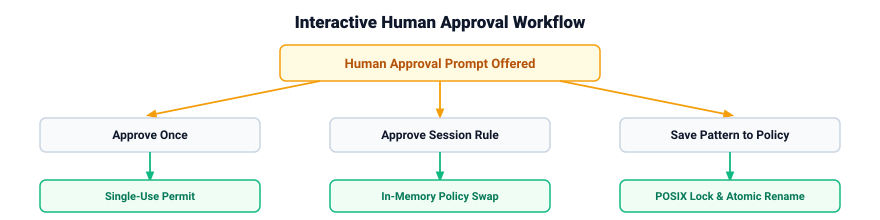

### 6.2 Conservative Pattern Derivation Algorithm
Rule pattern derivation converts specific executable calls into safe token patterns:
- **Volatile Positional Operand Replacement**: Replaces volatile positional arguments (branch names, package names, commit IDs) with single-token typed wildcards (`<branch>`, `<package>`).
- **Literal Prefix Enforcement**: Retains executables, subcommands, and flags literally (`git push origin <branch>`).
- **Adversarial Negative Witness Testing**: Generates synthetic negative test tokens to prove the wildcard cannot match hard-veto patterns (e.g., verifying `<branch>` cannot match `--force`).
- **Non-Learnable Action Rejection**: Refuses rule derivation for destructive commands (`rm -rf`), force pushes (`git push --force`), privilege escalation, or direct device writes.

### 6.3 Concurrent Atomic Persistence Protocol
Persisting rules to JSON policy files uses POSIX sibling lockfiles and atomic renames:

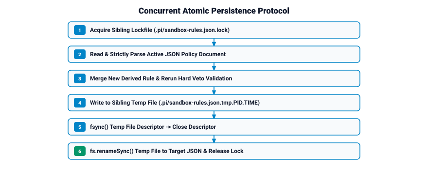

### 6.4 Live Reload Engine
Policy updates activate immediately across all running sessions:
- **File Watching & Polling Fallback**: Monitors `.pi/sandbox-rules.json` using `fs.watch` combined with a 3-second `fs.stat` polling fallback.
- **Debounced Coalescing**: Uses a 200 ms debounce window to merge multi-write watcher events.
- **Atomic In-Memory Policy Swap**: Compiles the updated JSON document and atomically replaces the active policy snapshot in memory, incrementing the policy revision counter.

### 6.5 Audit Logging Specification
All authorization decisions and human approvals append structured event records to `.pi/sandbox-audit.jsonl`:
- **Secret Sanitization**: Scans every log field for authorization tokens, bearer headers, private keys, and credential variables, replacing sensitive values with `"[REDACTED_SECRET]"`.
- **Log Rotation**: Automatically rotates audit logs when file size reaches 10 MB, retaining 5 historical log generations (`.jsonl.1` through `.jsonl.5`).

---

## 7. Inspection & Debugging Tools (`/sandbox policy check`)

### 7.1 Policy Check Command Pipeline
The `/sandbox policy check <command>` slash-command evaluates shell commands through a dry-run simulation pipeline without executing processes or creating permits:

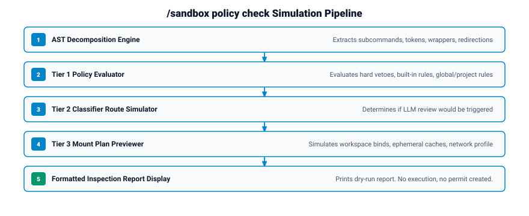

### 7.2 Simulation Output Example

```text
Sandbox Policy Check Simulation
Command: git push origin main

1. AST Decomposition:
   Status: Complete (1 executable unit)
   Unit 1: git push origin main
   Executable: git
   Wrapper Chain: none
   Tokens: ["git", "push", "origin", "main"]

2. Tier 1 Policy Evaluation:
   Decision: PROMPT
   Matched Rule: builtin/git-push (scope: builtin, decision: prompt)
   Justification: Remote branch push requires confirmation or explicit rule.

3. Tier 2 LLM Route Simulation:
   Route: Direct Human Approval (Bypasses LLM due to Tier 1 prompt rule)
   Classifier Trigger: Not Required

4. Tier 3 OS Sandbox Mount Preview:
   Root Mount: / (read-only)
   Workspace Root: /home/user/project (read-write)
   Protected Metadata: /home/user/project/.git (read-only mask)
   Ephemeral Caches: none
   Network Profile: full (git remote transport authorized)

Simulation complete. No process was executed. No permit created.
```

---

## 8. Failure Mode Matrix & Complete Verification Strategy

### 8.1 Failure Mode Matrix

| Failure Condition | Component Affected | Immediate Sandbox Action | System Route & Recovery |
| --- | --- | --- | --- |
| **AST Parse Error / Syntax Malformed** | AST Parser | Fast-path disabled | Marks AST incomplete; routes command to Tier 2 LLM or human approval. |
| **WASM Runtime Crash / Load Failure** | AST Parser | Fast-path disabled | Fails closed; routes whole command to Tier 2 or human review. |
| **Tier 1 Hard Veto Match** | Policy Engine | Fast-path blocks execution | Immediately blocks execution; returns non-overridable denial. |
| **LLM Provider Timeout / Network Error**| LLM Classifier | Tier 2 unavailable | Transmits request to interactive human review; no direct bypass. |
| **LLM Invalid JSON / Schema Violation**| LLM Classifier | Decision rejected | Treats decision as unsafe; routes request to human review. |
| **Landlock LSM Unsupported / Failure** | `bwrap-hardened` | Tier 3 boundary check | Fails closed; aborts process spawn with execution exit code 126. |
| **Seccomp BPF Profile Missing / Invalid**| Seccomp Filter | Tier 3 boundary check | Fails closed; prevents process spawn. |
| **Policy Lock File Timeout (>5s)** | Persistence Store | Rule save aborted | Cancels persistent write; offers single-use approval without saving. |
| **Audit Log Write Failure** | Audit Logger | Authorization blocked | Halts permit creation; blocks execution until log append succeeds. |
| **Permit Digest / Generation Mismatch** | Safety Gate | Execution boundary | Rejects permit consumption; blocks process spawn. |

### 8.2 Complete Verification Strategy

#### Native Test Suite Integration (`/sandbox-test`)
The extension includes a comprehensive test suite executed directly via `/sandbox-test`:
- **Unit Tests (`tests/run.ts`)**: Inverted-dependency unit tests covering AST decomposition, argument normalization, Starlark policy matching, JSON schema parsing, Landlock ruleset derivation, and audit log secret redaction.
- **Ephemeral Cache Pre-Flight Proof (`cache-proof.test.ts`)**: Validates host environment cache discovery, no-follow symlink traversal checks, and credential masking rules without invoking real mounts.
- **Hardened Shell Integration Test (`manual-sandbox-test.sh`)**: Verifies real Linux kernel containment using `bwrap` and `bwrap-hardened` inside an isolated test sandbox.

#### Verification Execution Commands

```bash
# 1. Run full native TypeScript test suite
/sandbox-test

# 2. Run optional Bun syntax compilation build
bun build extensions/bwrap-sandbox/index.ts --target=node --packages=external --outdir "$HOME/sandbox/bwrap-build"

# 3. Test policy inspection simulation pipeline
/sandbox policy check "cargo check --all-targets"
```
